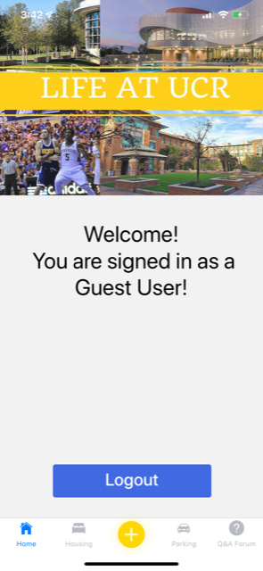

# UCR-Life-Guide-App

	

# Built With
- React-Native
- Firebase
- Node.js
- Expo

# Prerequisites
- Note that there may be some differences in installation if you’re on MacOS. 
- Note that you will also need JDK 1.8 (same as JDK 8) or above in order to use firebase 
- Some dependencies require python so make sure that is installed 
    - https://www.python.org/downloads/
      	- Check the button that includes PATH during setup, if you forgot to do so
    - Some dependencies also require Visual Studio on your computer for windows 
      	- npm install --global --production windows-build-tools
    - https://docs.expo.io/get-started/installation/
    
# Setup
1. `Install node.js from website`  (https://nodejs.org/en/download/)
     - node.js includes npm
     - Npm will be used to install necessary tools
 
2. `npm install react-native`
     - Used to install react-native
  
3. `npm install -g expo-cli`
     - Install expo, we will be using to test the app on the phone, avoids emulators (Also provides error codes)
 
4. Run `expo whoami` to verify the installation was successful

5. Create an account for expo using `expo register`
	- Requires:  
	    - Email  
        - User  
        - Password  
      
      
6. `expo login` (should be automatically logged in after signing up)

7. `Download the expo app on iOS/Android`

# Running Instructions
1. Clone :  https://github.com/YeeitsAlex/UCR-Life-Guide-App.git
    - You want to clone it inside your `Users` directory if you are on Windows, i.e. `C:\Users\YourUserName\UCR-Life-Guide-App`
2. After cloning the repo run cd into UCRLifeGuide (project directory) and run `npm install`
    - npm install` is ran to install needed dependencies for running the application
3. After npm install finishes, should be able to run `expo start`  (in the terminal/cmd)  inside project directory
    - **You will need to make sure your computer and your phone are on the same network**
    - The command will open up a browser tab, you can then scan QR code on your phone to open in expo to start the application.

# Features
**1. User Authentication using Firebase**
- User can create a new account
- User can login as a guest
- Existing user can login

	
	

**2. Home Screen**

- User will be greeted at the homepage with either:	
	- Name that they registered with
	- As a guest user
- User can `LOGOUT` from their account on this page

	

	

**3. Question and Answer Forum**
- User can view `Frequently Asked Questions`	
- User can view recent posts, which are retrieved from firebase
- User can `Refresh` the page to view the most recent posts

	

	

**4. Post Screen**
- User can ask a question or make a post. 
- This feature posts to the database, the post then shows up on `Recent Questions`

	

**5. Parking Screen**
- User can view multiple On-Campus and Off-Campus parking options for students at UCR
- Each item on the list will lead to its own screen, which contains helpful information for each parking destination
	

	

**6. Housing Screen**
- User can view multiple On-Campus and Off-Campus housing options around UCR
- Each item on the list will lead to its own screen, which contains information on each housing option

	

# Authors and Contributions
- Alexander Yee
	- Firebase Setup
	- User Authentication
	- UI/UX Design
	- README
	- Features Responsible For: 
		- Login, Registration, Logout
		- Homepage
		- Parking Screen
		- Question and Answer Screen
		- Post Screen
- Benjamin Lee
	- Researching data for housing screen
	- Features Responsible For: 
		- Housing Screen (Styling and Data)
		
